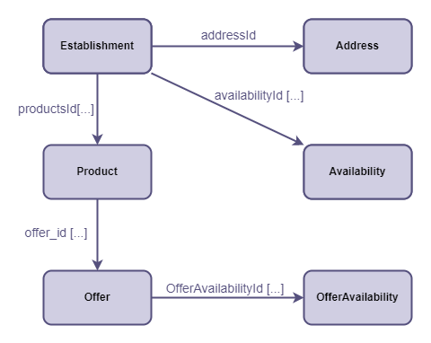

# Goomer Lista Rango

> **Desafio Goomer**: Desenvolverdor Backend Jr
>
> API RESTful para gerenciar restaurantes e seus respectivos cardápios. Utilizando Node.js, Typescript e PostgreSQL.

- [Iniciando a aplicação](#⚙-iniciando-a-aplicação)
- [Casos de uso](#casos-de-uso-implementados)
- [Banco de dados](#banco-de-dados)
- [Testes](#🧪-testes)
- [Melhorias](#📈-melhorias)
- [Pendências](#pendências)
- [Desafios / Problemas](#🤯-desafios--problemas)
---
## ⚙ Iniciando a Aplicação
1. Clonar o repositório da aplicação:
```sh
git clone https://github.com/LeonardoHirosue/goomer-lista-rango.git
``` 

2. Abrir diretório
```sh
cd goomer-lista-rango
``` 

3. Instalar dependências:
```sh
yarn
``` 
4. Configurar variáveis de ambiente tem .env:

Exemplo:
```env
PGUSER="postgres"
PGHOST="localhost"
PGPASSWORD="123456"
PGDATABASE="goomer-lista-rango"
PGPORT=5432
```

5. Criar o banco de dados
>PostgreSQL: [Rodar estes scripts no banco de dados](./src/database/scripts/database.sql).

6. Iniciar a aplicação:
```sh
yarn dev 
``` 
---
## Casos de Uso Implementados

### Restaurante

* Listar todos os restaurantes
* Cadastrar novos restaurantes
* Listar os dados de um restaurante
* Excluir um restaurante
* Alterar os dados um restaurante

---
## Banco de Dados



Establishment | type
:-------- | :------:
(PK) id | string 
name | string
image | string


Address   | type
:-------- | :------:
(PK) id | string
country | string
state | string
city | string
district | string
street | string
number | string
postal_code | string
complement | string
reference | string
(FK) establishment_id | string

Availability   | type
:-------: | :------:
(PK) id | string
day_of_week | string
start_time | string
end_time | string
(FK) establishment_id | string


---
## 🧪 ~~Testes~~

* ~~Iniciar testes no Jest (em uma próxima oportunidade tentar aplicar o conceito de TDD)~~.
* ~~Implementar tratamento de erros~~
> Colection Postiman: [Disponível aqui](./src/public/postman/goomer-lista-rango.postman_collection.json)

---
## 📈 Melhorias 
* Correção do "express-async-errors", para utilização do [Middleware de erros](./src/middlewares/error.ts) juntamente com a [classe ApiErrors](./src/helpers/ApiErrors.ts).
* Separar [EstablishmentRepository](./src/modules/establishments/repositories/postgresql/EstablishmentsRepository.ts) em EstablishmentRepository, AddressRepository e AvailabilityRepository.
* Documentação via Swagger.
* Finalizar [Pendências](#pendências).

---
## Pendências

### Restaurante
* ~~Foto do restaurante~~
* ~~Converter dados de Horário~~

### Produto
* ~~Listar todos os produtos de um restaurante~~
* ~~Criar um produto de um restaurante~~
* ~~Alterar um produto de um restaurante~~
* ~~Excluir um produto de um restaurante~~
* ~~Foto do produto~~
* ~~Nome do produto~~
* ~~Preço do produto~~
* ~~Categoria do produto (ex.: Doce, Salgados, Sucos...)~~

### Promoção

* ~~Descrição para a promoção do produto (ex.: Chopp pela metade do preço)~~
* ~~Dias da semana e o horário em que o produto deve estar em promoção~~

### Formato de horários
* ~~É necessário tratar os campos que indicam horários de funcionamento e horário para as promoções dos produtos.~~
* ~~Os campos devem possuir o formato HH:mm.~~
* ~~Os horários devem possuir intervalo mínimo de 15 minutos.~~

---
## 🤯 Desafios / Problemas
* Problemas para implementar a biblioteca "express-async-errors", perdi muito rempo tentando resolver, porém sem sucesso. O fato impactou diretamente no tratamento dos erros, pois todas as chamadas sáo assíncronas. O que leva a necessidade de reiniciar a aplicação quando um ApiError é instanciado...
* Por se tratar do meu primeiro projeto e primeira API, tive dificuldade em seguir uma linha de raciocínio para construção da aplicação, dedicando muito tempo com a refatoração do código e impossibilitando a estratégia de organização das branchs no Git.
* Apesar de todo o tempo dedicado à refatoração de código, estrutura de pastas e tentativa de tratamento de erros, aparentemente consegui implementar alguns conceitos do SOLID, como **Single Responsiblity Principle** e **Liskov Substitution Principle**
* Nos cursos em que estudei, a maioria dos bancos de dados são fictícios. Precisei consultar muito material para implementação do PostgreSQL puro, sem um ORM.
* O maior foco foi em entregar um código com qualidade e pastas bem organizadas, o que acabou me custando o tempo para finalizar outras partes mais simples do desafio, como por exemplo a implatação do CRUD de produtos, que aparenta ser mais simples do que a do restaurante...

